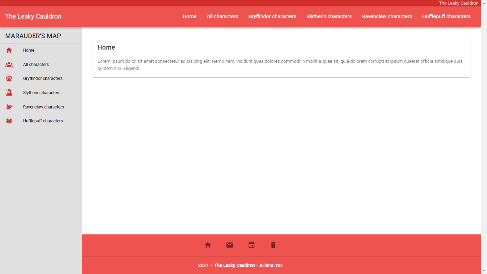
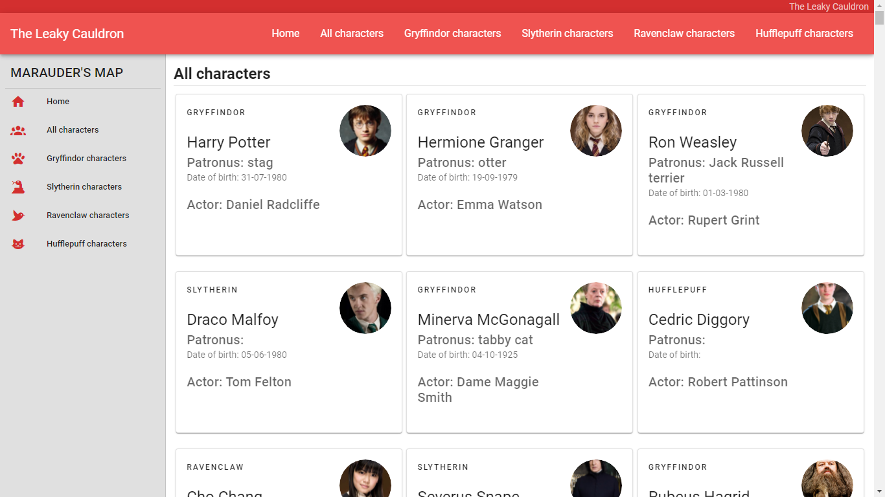
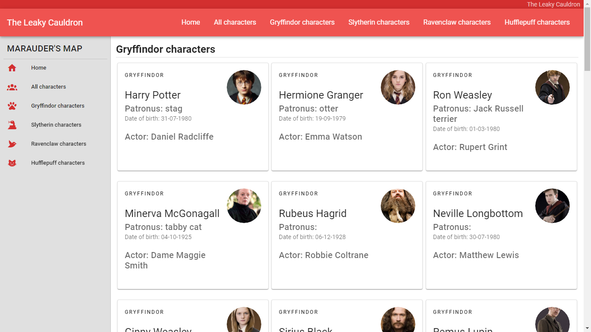

<h2 align="center">Caldeirão Furado</h2>

## View - Home


## View - All characters


## View - Gryffindor characters


## View - Slytherin characters


## View - Ravenclaw characters


## View - Hufflepuff characters


## Project setup
```
npm install
```

### Compiles and hot-reloads for development
```
npm run serve
```

### Compiles and minifies for production
```
npm run build
```

### Lints and fixes files
```
npm run lint
```

### Customize configuration
See [Configuration Reference](https://cli.vuejs.org/config/).
